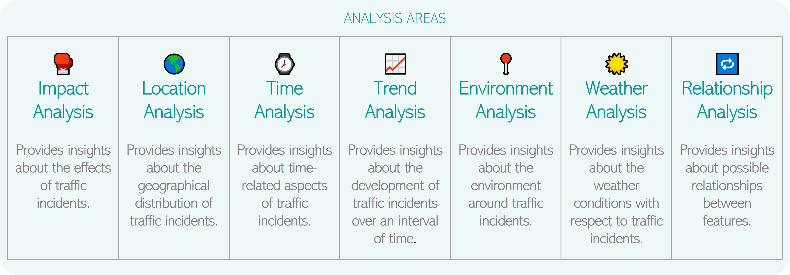
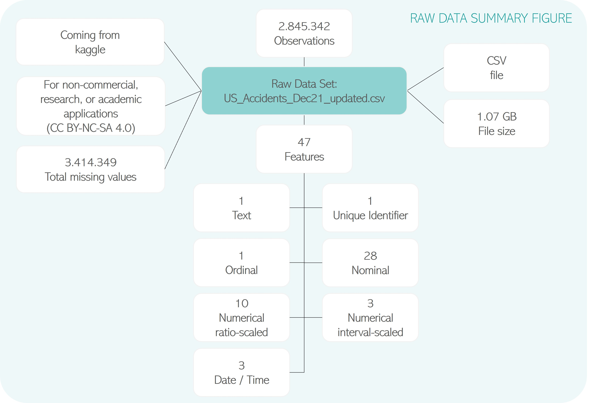
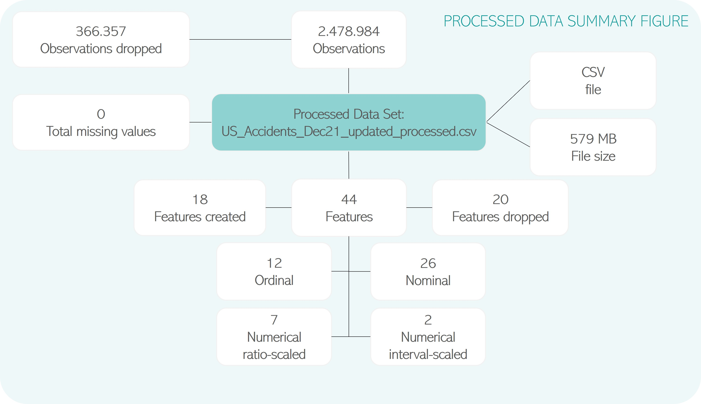

# Exploratory Data Analysis on US Traffic Incidents

(Developed in the course of a written assignment task for my study at IU)

## Introduction
The aim of this notebook is to demonstrate how a data set can be explored by support of descriptive statistics and visualizations based on design principles in order to getting familiar with the data set and gain insights. The goal is to analyze what has happened so far to discover meaningful insights from the data.

It represents how exploratory data analysis can be performed in a very structured way by support of pre-defined process steps each with a dedicated scope, input and output based on a large data set with nearly 3 million observations and 47 features about traffic incidents within the United States from 2016 to 2021, namely the [US Accidents (2016 - 2021) data set](https://www.kaggle.com/datasets/sobhanmoosavi/us-accidents), provided by Sobhan Moosavi on Kaggle. 

In addition, interesting insights are revealed, and meaningful visualizations are presented as well in different areas such as impact, location, time, trend, environment, weather, and relationship analysis.

The results of this notebook can be used as blueprint for approaching exploratory data analysis in general and to understand traffic incidents better in order to utilize this knowledge for real world applications that can answer what is going to happen to predict future events and scenarios based on this data.

## Source Code

The Jupyter notebook itself and the attachments can be found on
- Kaggle: https://www.kaggle.com/code/anjakuchenbecker/eda-on-us-traffic-incidents/ (recommended due to better rendering as on GitHub)
- GitHub: https://github.com/anjakuchenbecker/eda_on_traffic_incidents

## Handout
In case if you are only interested on the insights and not on the source code and the way how the insights have been discovered, you can directly open the PDF handout that contains all analysis results in condensed form.

Please download the handout here: 

https://raw.githubusercontent.com/anjakuchenbecker/eda_on_traffic_incidents/main/EDA_US_Traffic_Incidents_Handout.pdf

## Raw Data Summary figure

## Processed Data Summary figure

